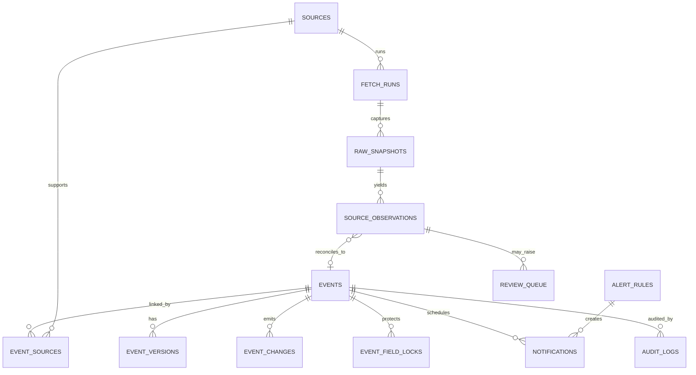
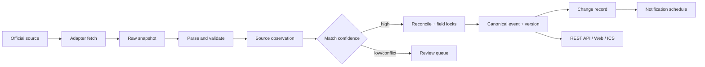

# 架构、ER 与数据流

## ER 图

核心约束：来源观察与标准事件分离；正式事件至少关联一个来源；人工事件关联内建的 `manual` 来源；版本保存完整快照；字段锁按事件和字段唯一；通知使用事件版本参与幂等键。

## 数据流

## 幂等与恢复

- Fetch Run 以来源、计划时间和触发类型唯一；Worker 使用 PostgreSQL advisory lock。
- Snapshot 用内容 SHA-256 去重，Observation 用来源与来源事件 ID/指纹去重。
- Event 通过 canonical key 和显式匹配关系避免重复；相同快照更新不产生版本。
- Notification 唯一键为 `channel + event + alert_type + schedule + version`。
- 单次空结果仅标记运行异常，不批量删除或取消事件。

